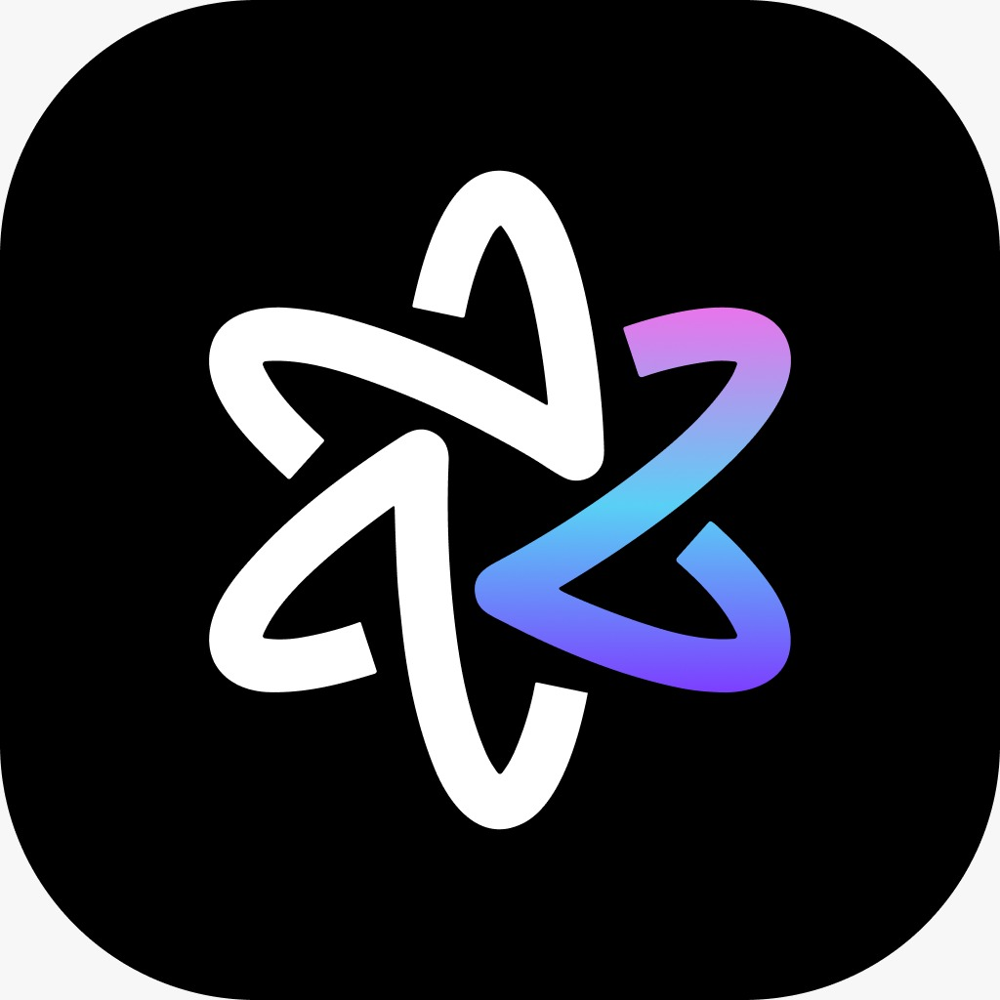
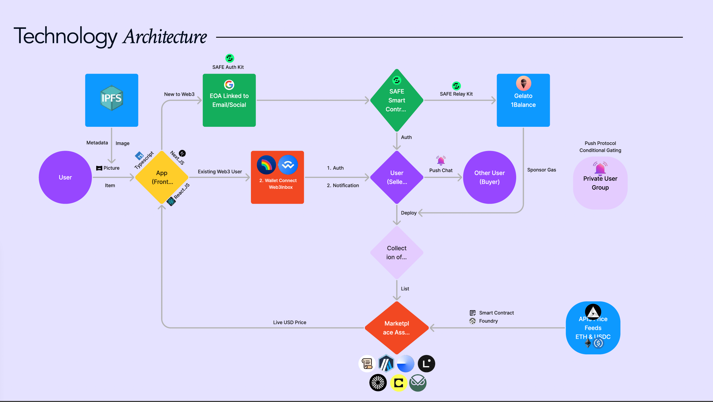

# ETHGlobal_Istanbul_RWA_Infra

# AssetFuse

## Summary
AssetFuse: Transform real-world valuables into blockchain-based assets. Seamlessly tokenize, trade, and explore new opportunities in the digital world. Your assets, your control.

## Problem & opportunity
Traditional assets face liquidity challenges, often restricted by geographical barriers and limited market accessibility. High-value items with small volumes such as watches, jewelry, antiques, and luxury goods remain illiquid, hindering broader investment participation. This exclusivity stifles opportunities for fractional ownership and inhibits the potential for a more dynamic and inclusive financial ecosystem.

However, the rise of blockchain and decentralized finance (DeFi) presents an unprecedented opportunity. By leveraging tokenization technology, we can transform these traditionally illiquid assets into digital tokens, enabling fractional ownership, global market access, and 24/7 trading. This unlocks vast liquidity and investment potential, offering a paradigm shift in how we perceive, trade, and invest in real-world assets.

Furthermore, according to , the total value of RWA tokenization is expected to increase from $300 billion in 2022 to over $10 trillion by 2023, representing a 30x increase.

## Solution
Introducing AssetFuse—a groundbreaking platform that bridges the gap between the physical and digital worlds of asset ownership. AssetFuse leverages blockchain and smart contract technology to tokenize real-world assets, transforming them into tradable digital assets represented by Non-Fungible Tokens (NFTs).

With AssetFuse, users can easily express interest in tokenizing their valuable items, and seamlessly tokenize their assets on the blockchain. These tokenized assets can then be traded on our platform, providing increased liquidity and accessibility. Furthermore, users have the option to participate in the broader decentralized finance landscape by listing their assets on our exchange or porting them to external marketplaces like Opensea.

### Technology architecture and customer flow

## User Flow (for buyer and seller)
We aim to create the best consumer decentralized app to help onboard SME's into Web3 seamlessly. The customer journey for seller (shop owner) will be like this:
1. User (shop owner or small business in this case) comes to the landing page of AssetFuse, they can read the description of the website. The website is made with Next.js (written in Typescript) and deployed on Vercel.
2. Seller can connect their wallet to begin their journey. One of the following scenarios will happen:
2a. If seller is new to Web3 and doesn't have a wallet yet, he/she can sign up with just their email address or Gmail login through Safe Auth Kit Account-Abstraction. On the backend, the email will be linked to an Externally-Owned Account (EOA) that is linked to a Safe smart contract wallet.
2b. If seller already has existing wallet, he/she can log in with WalletConnect or Metamask or other login options.
3. User can either take a picture with their mobile camera or upload a picture of the real-world valuable from their gallery.
3a. If user chooses to take a picture with the mobile camera, a QR code will pop up to inform user to scan with their mobile phone. After opening up the url with their phone, user can take a photo with their mobile phone and then the photo will be uploaded to IPFS and pinned down by Piñata.
4. Once the image is submitted, user can proceed to fill out the detailed information for the item. The essential information is: item name, category, item condition, and detailed item description.
5. Then user will specify the price he would like to have the item listed for in either USDC or ETH. The front-end will display the equivalent USD price. The live USD price is made possible thanks to API3 price data feeds on applicable testnets where API3 proxy contract addresses exist.
6. After specifying all these conditions, user can decide to tokenize their item or not. If they want to tokenize it, a message will pop up asking for their permission to approve the minting transaction. Thanks to Safe Relay Kit and Gelato 1Balance, the transaction will be sponsored by our marketplace (AssetFuse) and it will not cost the seller any gas fees, improving the user experience.
7. After the minting is complete, seller will receive the NFT in their wallet. The NFT will belong to a collection owned by the shop. Seller can proceed to list the NFT on our marketplace (AssetFuse), or they can also bring the NFT to other marketplaces like OpenSea.
8. Thanks to Wallet Connect Web3Inbox, both buyers and sellers can subscribe to receive notifications.

The customer journey for buyer on the marketplace will be like this:
1. Customer (buyer) comes to the marketplace website and browse the listed items.
2. Buyer can create a new account or login with their existing wallet similar to the step 2. above for seller. For buyers who do not have any crypto on-chain yet, we have incorporated Unlimit UI in there so that buyers can on-ramp quickly and smoothly with credit card or debit card, subjecting to relevant laws and regulations of the buyer's country.
3. Once buyer clicks on an item, he/she can either buy at the currently listed price, make an offer, or chat with the seller. The direct wallet-to-wallet chat is made possible thanks to Push Chat from Push Protocol. With the chat, buyer can ask questions about the item and negotiate directly with the seller.
4. If buyer buys the item, then the NFT ownership will be transferred to the buyer. Then buyer and seller can communicate with one another to decide whether they want (this part is not shown during the hackathon demo):
4a. The physical item can be shipped to the buyer's desired address and the NFT will then be burned accordingly.
4b. The physical item can be shipped to our marketplace's warehouse where we will hold custody of the item and buyer can do what he/she wants with the NFT. Ideally, our marketplace will buy some insurance to insure the value of the goods in our warehouse.

For buyers who have already bought an item from a specific shop, then seller can create an NFT gated group chat where each participant in the chat must own an NFT from the seller's (shop's) collection. We use Push Protocol's Conditional Gating of group to carry this out.

## Future Work
Some thoughts for how the whole project can be built out further:
- Integrate an image-recognition machine learning model to suggest retail price based on similar items listed on other marketplaces.
- Integrate the ability for sellers and buyers to leave review for each other after each transaction.
- Enable seller to upload more than 1 picture at a time.

## Deployed contract (all verified)
### Scroll Sepolia Testnet  (chainID: 534351)
| Contract |                           Contract address |
| :------- | -----------------------------------------: |
| Marketplace  | 0xD533833fe737150C8935D57039398CC5322f2dAb |
Contract link: https://sepolia.scrollscan.dev/address/0xD533833fe737150C8935D57039398CC5322f2dAb

### Gnosis Chain mainnet (chainID: 100)

| Contract    |                           Contract address |
| :---------- | -----------------------------------------: |
| Marketplace  | 0x485247D991959C04A2D80a625647adD3Ce45CE6C |

The verified smart contract for Gnosis Chain mainnet is:
https://gnosisscan.io/address/0x485247D991959C04A2D80a625647adD3Ce45CE6C

### Celo Alfajores Testnet (chainID: 44787)

| Contract    |                           Contract address |
| :---------- | -----------------------------------------: |
| Marketplace    | 0x485247D991959C04A2D80a625647adD3Ce45CE6C |
The verified smart contract on Celo Alfajores is:
https://alfajores.celoscan.io/address/0x485247D991959C04A2D80a625647adD3Ce45CE6C

### Base Goerli testnet (chainID: 84531)

| Contract    |                           Contract address |
| :---------- | -----------------------------------------: |
| Marketplace    | 0x485247D991959C04A2D80a625647adD3Ce45CE6C |
The verified smart contract on Base Goerli testnet is:
https://goerli.basescan.org/address/0x485247D991959C04A2D80a625647adD3Ce45CE6C

### Arbitrum Goerli testnet (chainID: 421613)

| Contract    |                           Contract address |
| :---------- | -----------------------------------------: |
| Marketplace    | 0x80Aa447D916aa168F8656196fa0Bb2b2B84Ad898 |
The verified smart contract on Arbitrum Goerli testnet is:
https://goerli.arbiscan.io/address/0x485247D991959C04A2D80a625647adD3Ce45CE6C

### Linea testnet (chainID: 59140)

| Contract    |                           Contract address |
| :---------- | -----------------------------------------: |
| Marketplace   | 0x485247D991959C04A2D80a625647adD3Ce45CE6C |
The verified smart contract for Linea testnet is:
https://testnet.lineascan.build/address/0x485247D991959C04A2D80a625647adD3Ce45CE6C

### Mantle testnet (chainID: 5001)

| Contract    |                           Contract address |
| :---------- | -----------------------------------------: |
| Marketpace    | 0x485247D991959C04A2D80a625647adD3Ce45CE6C |
The verified smart contract for Mantle testnet is:
https://explorer.testnet.mantle.xyz/address/0x485247D991959C04A2D80a625647adD3Ce45CE6C

## Others

### Demo movie

### Demo site
https://rwa-infra-samuelqzq.vercel.app/

### How to run locally
1. Go to the dapp (frontend) folder
2. yarn install
3. yarn dev
